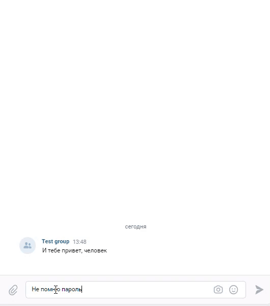

# Скрипты чатботов Telegram и VK c ботом помощником.

## Общее описание
Данные боты могут самостоятельно отвечать на некоторые вопросы которые указаны в файле `questions.json`.
В случае, когда бот не в состоянии ответить на введенную фразу, то он не отвечает.    
### Скриншот телеграм бота.   
   
### Скриншот VK бота.   

   
## Установка

Создайте виртуальное окружение командой:

```commandline
python3 -m venv env
```

Войдите в виртуальное окружение командой:
```commandline
source env/bin/activate
```

Установите зависимости командой:
```commandline
pip install -r requirements.txt
```

Установите gcloud CLI по [иструкции](https://cloud.google.com/sdk/docs/install)

Создайте проект в Google Cloud по [инструкции](https://cloud.google.com/dialogflow/es/docs/quick/setup)

Создайте агента DialogFlow по [инструкции](https://cloud.google.com/dialogflow/es/docs/quick/build-agent)

Создайте группу в VK на вкладке "Управление"

Создайте файл `.env` и внесите туда:
1. TELEGRAM_TOKEN=[Ваш TOKEN из телеграм]
2. GOOGLE_APPLICATION_CREDENTIALS=[Путь к файлу JSON ключа ]
    для создания этого файла выполните команду ```gcloud auth application-default login```
    файл будет храниться в папке (к примеру): `/.config/gcloud/application_default_credentials.json`
3. DIALOGFLOW_PROJECT_ID='ваш идентификатор проекта'
   Это номер проекта после регистрации на Google Cloud
4. VK_TOKEN='Ваш токен группы в VK'
5. TG_CHAT_ID='ваш номер чата' - в этот чат будут отправляться сервисные сообщения.

Заполните вопросами и ответами ваш DialogFlow из файла `questions.json` командой
```commandline
python intent_utils.py
```
Для обучения новым фразам в корне репозитория нужно создать файл `questions.json` и добавить в него нужные вопросы и ответы.
Примерная структура файла:

```
{
    "Устройство на работу": {
        "questions": [
            "Как устроиться к вам на работу?",
            "Как устроиться к вам?",
            "Как работать у вас?",
            "Хочу работать у вас",
            "Возможно-ли устроиться к вам?",
            "Можно-ли мне поработать у вас?",
            "Хочу работать редактором у вас"
        ],
        "answer": "Если вы хотите устроиться к нам, напишите на почту game-of-verbs@gmail.com мини-эссе о себе и прикрепите ваше портфолио."
    },
    "Забыл пароль": {
        "questions": [
            "Не помню пароль",
            "Не могу войти",
            "Проблемы со входом",
            "Забыл пароль",
            "Забыл логин",
            "Восстановить пароль",
            "Как восстановить пароль",
            "Неправильный логин или пароль",
            "Ошибка входа",
            "Не могу войти в аккаунт"
        ],
        "answer": "Если вы не можете войти на сайт, воспользуйтесь кнопкой «Забыли пароль?» под формой входа. Вам на почту прийдёт письмо с дальнейшими инструкциями. Проверьте папку «Спам», иногда письма попадают в неё."
    },
}
```

## Запуск скриптов

Для запуска Telegram бота выполните команду:
```commandline
python tg_bot.py
```

Для запуска VK бота выполните команду:
```commandline
python vk_bot.py
```